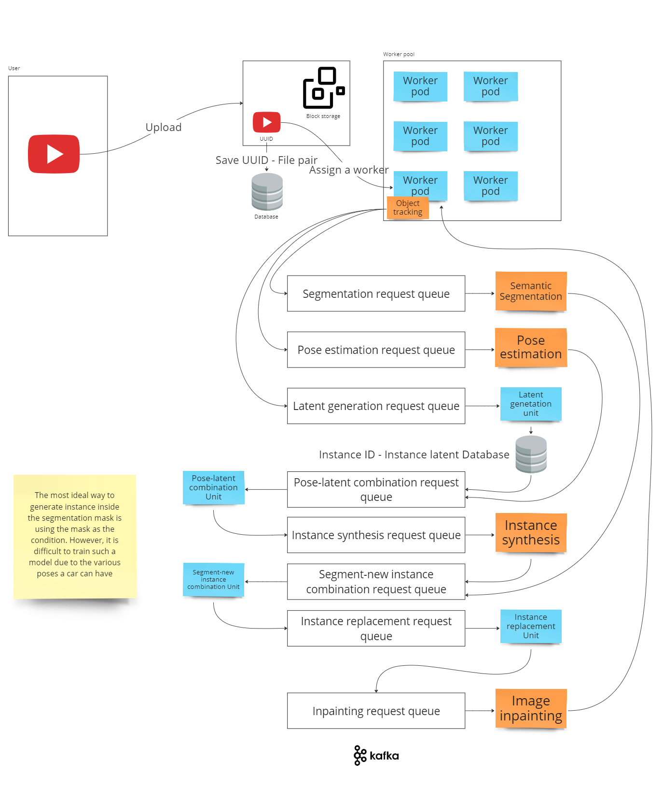

# Vision Middleware

These middleware units are a part of a computer vision system that comprises a benchmark for video anonymization. The system aims to anonymize individuals sensitive objects within videos with an instance-level video transformation approach, as described in [INSPIRE: Instance-level Privacy-preservingTransformation for Vehicular Camera Videos](https://ieeexplore.ieee.org/document/10230162).

This repository's specific benchmark offers a comparison of Node.js and Golang in the context of Kafka and computer vision microservices. Futhermore, Node.js offers two libraries, [kafka-js](https://github.com/tulios/kafkajs) and [node-rdkafka](https://github.com/Blizzard/node-rdkafka) of which each is said to have its advantanges in write and read operations.

## Design



## Units

Other components of the system can be found in other repositories within the organization. The following middleware units are featured:

* **Latent Generation**
    - Generates random latent images for anonymization.
    - Stores latents in a key-value database with expiration.
* **Pose-Latent Combination**
    - Combines pose estimation tags and segmentation binary masks.
    - Stores intermediate results in caches for efficient processing.
* **Segment-New Instance Combination**
    - Similar to the Pose-Latent Combination Unit.
    - Handles additional data types for instance replacement.


## Technology Stack
- Kafka
- Redis 

## Installation

Node.js:

```bash
./install.sh node
```

Go:

```bash
./install.sh go
```

## Run

Node.js:

```bash
./run.sh node
```

Go:

```bash
./run.sh go
```